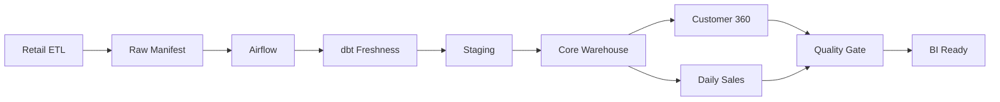

# Northwind Outfitters Workflow Automation Platform

[](https://github.com/j-watterson/workflow-automation-platform/actions/workflows/ci.yml)
[](https://airflow.apache.org/)
[](LICENSE)

## 1. Executive Summary

Northwind Outfitters automated order ingestion and centralized reporting, but
warehouse refreshes still depended on engineers running commands manually.
Missed runs, partial upstream deliveries, and unclear failures could leave BI
dashboards stale without a consistent recovery process.

This project introduces Apache Airflow as the workflow automation layer. It
validates raw-data readiness, checks source freshness, builds dbt warehouse
layers in dependency order, runs independent BI marts in parallel, enforces
quality gates, and emits structured operational context.

It orchestrates the earlier
[Retail Analytics Platform](https://github.com/j-watterson/retail-analytics-platform) and
[Customer Analytics Warehouse](https://github.com/j-watterson/customer-analytics-warehouse).

## 2. Business Value

- BI dashboards refresh automatically on a predictable daily schedule.
- Partial or stale source deliveries are stopped before reaching analysts.
- Finance and marketing models run concurrently after shared dependencies.
- Retries handle temporary failures without immediate manual intervention.
- Run history and task logs make ownership and recovery clear.
- Explicit backfill procedures support controlled historical corrections.

## 3. Architecture



See [Architecture](docs/architecture.md) for task topology, scheduling
semantics, reliability controls, and the deployment model.

## 4. Technology Stack

- Apache Airflow 3.3 for scheduling, retries, dependencies, and observability
- Airflow Task SDK for the public DAG authoring interface
- dbt Core and dbt-bigquery for warehouse execution
- PostgreSQL for local Airflow metadata
- Docker Compose for a reproducible multi-service development environment
- Python standard library for manifest contracts and structured callbacks
- GitHub Actions for tests, image builds, and Compose validation

## 5. Data Flow

1. The retail pipeline publishes a manifest after raw tables are ready.
2. Airflow validates its age, business date, expected sources, statuses, and row
   counts.
3. dbt verifies source freshness directly in BigQuery.
4. Staging views standardize the delivered sources.
5. Core facts and dimensions build after staging succeeds.
6. Customer 360 and daily finance marts run concurrently.
7. dbt tests enforce the final BI contracts.
8. Airflow records a structured success or failure event with run context.

## 6. Engineering Decisions

| Decision | Rationale and tradeoff |
| --- | --- |
| Explicit cron data-interval timetable | Preserves daily interval semantics across Airflow versions; slightly more code than a cron string. |
| `catchup=False` | Prevents accidental load floods on activation; intentional history uses controlled backfills. |
| One active DAG run | Avoids overlapping BigQuery incremental merges; limits throughput during long backfills. |
| Manifest plus source freshness | Checks both business completeness and warehouse recency; requires an upstream manifest contract. |
| Task groups | Keeps the DAG readable while preserving task-level visibility. |
| Parallel BI marts | Reduces wall-clock refresh time after shared core models succeed. |
| Provider-neutral callback | Works without locking alerts to one vendor; production still needs a delivery integration. |

## 7. Production Features

- Explicit, timezone-aware daily data intervals
- Upstream source manifest contract
- dbt source freshness gate
- Exponential retry backoff and bounded retry count
- Task and DAG execution timeouts
- Controlled task and DAG-run concurrency
- Parallel independent BI workloads
- Structured failure payloads with log URLs
- Final warehouse quality gate
- Airflow 3 backfill procedures
- LocalExecutor and PostgreSQL development stack
- Dependency-free unit and structural tests
- CI container and Compose validation

## Quick Start

Run local validation without installing Airflow:

```bash
make test
```

Start Airflow with the three portfolio repositories as sibling directories:

```text
GitHub - Portfolio/
├── retail-analytics-platform/
├── customer-analytics-warehouse/
└── workflow-automation-platform/
```

```bash
cd workflow-automation-platform
cp ../customer-analytics-warehouse/profiles.yml.example \
   ../customer-analytics-warehouse/profiles.yml
# Configure the GCP project and authenticate.
printf 'AIRFLOW_UID=%s\n' "$(id -u)" > .env
make init
make up
```

Open `http://localhost:8080` and enable
`northwind_daily_warehouse_refresh`. The DAG is paused on creation so it cannot
write to BigQuery unexpectedly.

## Repository Structure

```text
.
├── config/pipeline.json
├── dags/
│   ├── include/raw_manifest.json
│   └── northwind_daily_warehouse.py
├── docs/
│   ├── architecture.md
│   ├── backfill.md
│   └── runbook.md
├── src/northwind_workflows/
│   ├── callbacks.py
│   ├── config.py
│   └── manifest.py
├── tests/
├── compose.yaml
├── Dockerfile
└── requirements.txt
```

## 8. Scalability

LocalExecutor is appropriate for this portfolio environment, not a large
production deployment. At higher concurrency, deploy through a managed Airflow
service or KubernetesExecutor, move logs to object storage, and use workload
identity and autoscaling workers.

The DAG already exposes parallel finance and marketing branches. Additional
domain marts can branch from the shared core layer, while Airflow pools can
limit aggregate BigQuery concurrency and cost.

## 9. Future Improvements

- Replace the demonstration file manifest with an Airflow Asset event.
- Forward structured callbacks to Slack or PagerDuty.
- Add BigQuery cost and row-count reconciliation tasks.
- Store credentials and connections in a cloud secret backend.
- Add OpenLineage metadata and centralized operational dashboards.
- Use dynamic task mapping for independently refreshed domain marts.
- Add data-quality trend monitoring in the next portfolio phase.
- Provision Airflow infrastructure and permissions with Terraform.

## 10. Interview Talking Points

- **Business problem:** Reliable models existed, but manual execution still made
  reporting late and failure recovery inconsistent.
- **Architecture:** A daily Airflow interval validates upstream delivery, runs
  dbt layers in order, parallelizes BI marts, and enforces a final test gate.
- **Biggest challenge:** Preventing incomplete data from appearing successful
  merely because a source table existed.
- **Tradeoff:** One active run protects incremental merges but slows large
  historical backfills.
- **Why this design:** It separates orchestration from transformation and keeps
  each failure visible at the correct operational boundary.
- **Production improvements:** Managed Airflow, remote logs, secret management,
  workload identity, alert delivery, pools, and lineage.
- **Engineering lesson:** Scheduling a command is not orchestration; production
  workflows also need contracts, concurrency controls, retries, timeouts,
  quality gates, observability, and recovery procedures.
