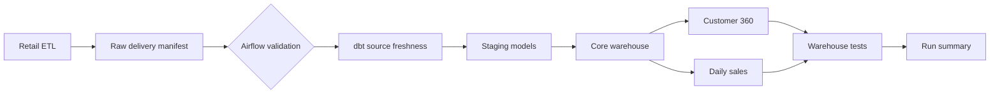
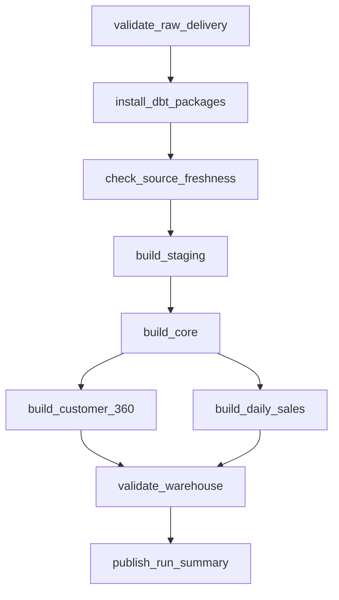

# Architecture

## System Context

The Workflow Automation Platform is the third Northwind Outfitters portfolio
project. It schedules and observes the daily handoff between the
[Retail Analytics Platform](https://github.com/j-watterson/retail-analytics-platform) and the
[Customer Analytics Warehouse](https://github.com/j-watterson/customer-analytics-warehouse).

## DAG Topology

The two BI marts run in parallel after the shared core model completes. Final
tests form a quality gate before the workflow reports success.

## Scheduling Semantics

The DAG uses `CronDataIntervalTimetable` explicitly instead of relying on
version-dependent cron defaults. It runs at 06:00 UTC and represents the
preceding daily interval. `catchup=False` avoids an accidental historical flood
when the DAG is first enabled; intentional history is processed with an
explicit backfill.

Only one DAG run can be active at once. This prevents overlapping BigQuery
merges while still allowing independent BI marts to use task-level parallelism.

## Reliability Controls

| Control | Purpose |
| --- | --- |
| Raw manifest contract | Prevents partial upstream deliveries from entering BI |
| dbt source freshness | Detects a technically present but stale source |
| Two retries | Handles transient service and network failures |
| Exponential backoff | Reduces pressure on an unhealthy dependency |
| Execution timeout | Prevents indefinitely hung tasks |
| DAG run timeout | Bounds the complete warehouse refresh |
| Max active run | Prevents conflicting incremental merges |
| Structured callback | Preserves task, attempt, run, exception, and log context |
| Final dbt tests | Blocks success when BI contracts fail |

## Deployment Model

Docker Compose provides a local development environment with:

- PostgreSQL for Airflow metadata;
- the Airflow API server and UI;
- scheduler and standalone DAG processor;
- triggerer for deferrable work;
- LocalExecutor for task execution;
- the sibling dbt warehouse mounted read/write at `/opt/airflow/dbt`.

Production should use a managed Airflow service or Kubernetes deployment,
remote log storage, a secret backend, workload identity, and independent worker
capacity.
